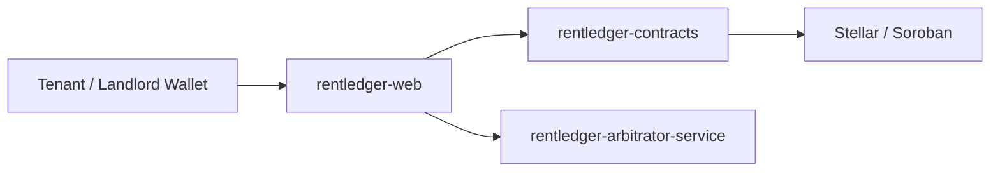

# RentLedger Web

Mobile-first React/Vite frontend for the RentLedger product. This repo is the user-facing layer for tenants, landlords, and arbitrators.

## What This Repo Owns

- Freighter wallet connection.
- Lease initiation UI.
- Lease state and transaction feedback.
- SPA deployment to Vercel.

## How It Fits In the System

The frontend is the interaction layer, not the source of truth.



## Local Setup

```bash
npm install
npm run dev
```

Create `.env.local` when needed:

```text
VITE_STELLAR_NETWORK=testnet
VITE_RENT_ESCROW_CONTRACT_ID=
VITE_STELLAR_MAINNET_RPC_URL=
```

## Vercel Deployment

This repo is configured as a proper SPA for Vercel.

- Build command: `npm run build`
- Output directory: `dist`
- SPA fallback: `vercel.json` rewrites every route to `index.html`

Suggested Vercel environment variables:

```text
VITE_STELLAR_NETWORK=testnet
VITE_RENT_ESCROW_CONTRACT_ID=
VITE_STELLAR_MAINNET_RPC_URL=
```

## UI Scope

The current UI is intentionally small:

- Connect a wallet.
- Draft a lease.
- Review escrow totals.
- Provide visible status blocks for rent release, deposit lock, and disputes.

## Contributor Tasks

- Generate TypeScript bindings from deployed WASM.
- Submit signed XDR through RPC after Freighter signing.
- Add release, refund, dispute, and arbitrator views.
- Add Playwright mobile tests for critical lease flows.
- Add route-level contract state views once the backend surface is finalized.

## Related Repositories

- `rentledger-contracts`: Soroban escrow contracts.
- `rentledger-arbitrator-service`: off-chain dispute intake and coordination API.
- `rentledger-docs`: product, protocol, and governance docs.
